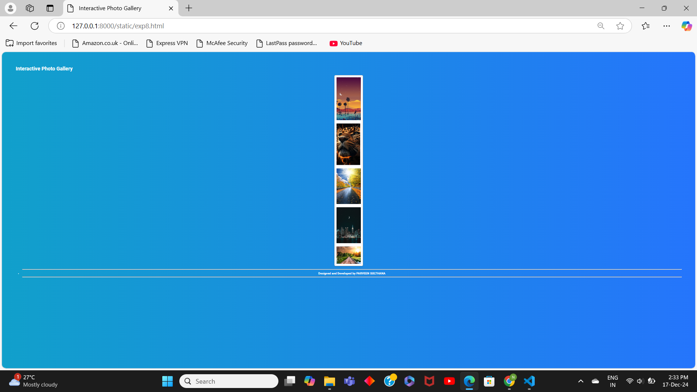

# Ex.08 Design of Interactive Image Gallery
## Date:16:12:2024

## AIM:
To design a web application for an inteactive image gallery with minimum five images.

## DESIGN STEPS:

### Step 1:
Clone the github repository and create Django admin interface.

### Step 2:
Change settings.py file to allow request from all hosts.

### Step 3:
Use CSS for positioning and styling.

### Step 4:
Write JavaScript program for implementing interactivity.

### Step 5:
Validate the HTML and CSS code.

### Step 6:
Publish the website in the given URL.

## PROGRAM :

```
index.css


@import url('https://fonts.googleapis.com/css2?family=Delius&family=Pacifico&family=Quicksand:wght@300..700&family=Roboto:ital,wght@0,100;0,300;0,400;0,500;0,700;0,900;1,100;1,300;1,400;1,500;1,700;1,900&display=swap');

body {
    margin: 2%;
    font-family: "Roboto", serif;
    font-weight: 700;
    font-style: normal;
    background-image: linear-gradient(to right, #6a11cb 0%, #2575fc 100%);
    color: white;
    text-align: center;
}

h1 {
    margin-bottom: 20px;
    font-size: 2em;
    color: white;
    text-align: left;
}

.container {
    display: flex;
    justify-content: center;
    align-items: flex-start;
    gap: 20px;
}

.gallery {
    display: flex;
    flex-direction: column;
    align-items: center;
    gap: 15px;
    padding: 10px;
    border: 2px solid #ccc;
    background-color: #fff;
    box-shadow: 0 4px 8px rgba(0, 0, 0, 0.1);
    border-radius: 8px;
}

.preview {
    width: 150px;
    border: 3px solid transparent;
    transition: border-color 0.3s, transform 0.3s;
    cursor: pointer;
    border-radius: 4px;
}

.preview:hover {
    border-color: #4facfe;
    transform: scale(1.05);
}

#image {
    width: 575px;
    height: 669px;
    border: 5px solid #333;
    background-color: #8e68ff;
    background-size: cover;
    background-repeat: no-repeat;
    background-position: center;
    color: #ffffff;
    font-size: 1.5em;
    display: flex;
    align-items: center;
    justify-content: center;
    border-radius: 8px;
    box-shadow: 0 4px 8px rgba(0, 0, 0, 0.2);
}

img {
    width: 100%;
    border-radius: 4px;
}

exp8.html

<!DOCTYPE html>
<html lang="en">

<head>
  <meta charset="UTF-8">
  <meta name="viewport" content="width=device-width, initial-scale=1.0">
  <title>Interactive Photo Gallery</title>
  <link rel="stylesheet" href="index.css">
</head>

<body>
    <h1>Interactive Photo Gallery</h1>
    <div class="container">
      <div class="gallery">
        
        
        
        
        

      </div>
      </div>
  </body>
  
<script src="index.js"></script>

</html>


index.js

const imageDiv = document.getElementById("image");
const originalImageUrl = "";
const originalText = "Hover over an image below to display here"
function upDate(previewPic) {
  imageDiv.style.backgroundImage = url('${previewPic.src}');
  imageDiv.innerHTML = previewPic.alt;
}

function unDo() {
  imageDiv.style.backgroundImage = url('${originalImageUrl}');
  imageDiv.innerHTML = originalText;
}


```


## OUTPUT:



## RESULT:
The program for designing an interactive image gallery using HTML, CSS and JavaScript is executed successfully.
